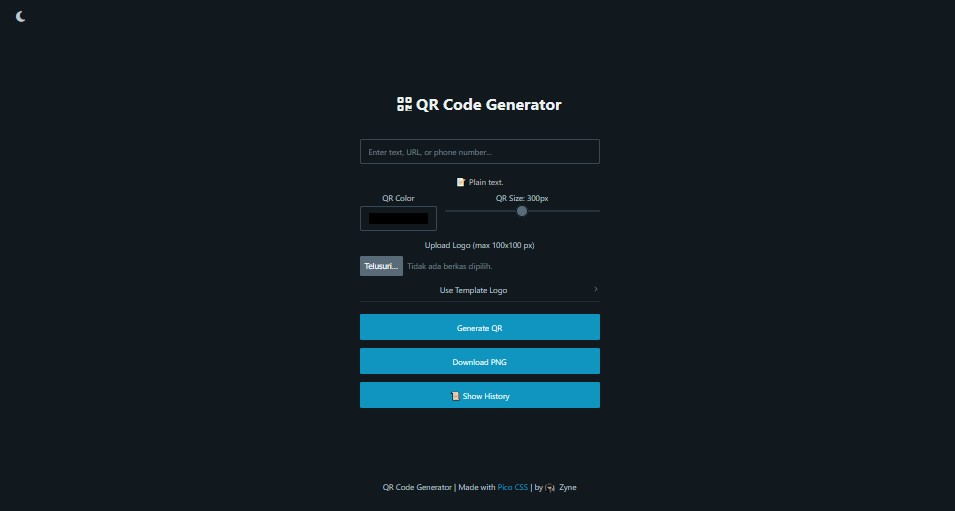
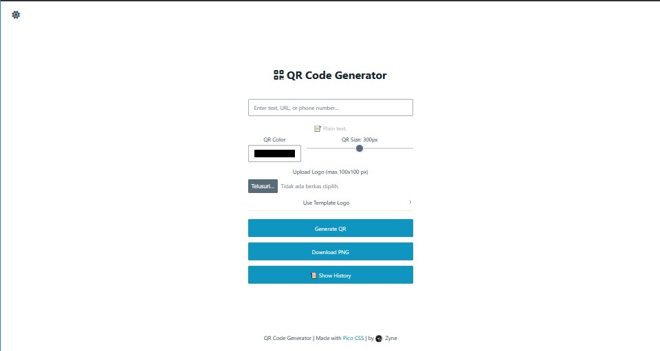

# QR Code Generator | Zyne

A modern, responsive QR Code Generator built with HTML, CSS (PicoCSS), and JavaScript. Customize QR codes with color, size, and embedded logos. Includes auto-detection of content type and a local history feature for recent QR codes.

## 🖼️ Screenshots

| Dark Mode                        | Light Mode                        |
| -------------------------------- | --------------------------------- |
|  |  |


## 🚀 Features

* 🔗 Auto-detects URLs, phone numbers, or plain text
* 🎨 Customize QR color and size
* 📷 Upload custom logo or image
* 💾 Local storage support for QR history (last 10 entries)
* 🌗 Toggle between dark and light theme
* 📥 Download QR codes as PNG
* 📜 Interactive history with click-to-restore

## 📘 How to Use

1. Visit this site [QR Code Generator | Zyne](https://zyne-24.github.io/qr-code-generator/)
2. Enter any **text**, **URL**, or **phone number** in the input field.
3. Adjust **color** and **size** as desired.
4. Upload your **custom logo** (Optional).
5. Click **Generate QR** to create the code.
6. Click **Download PNG** to save the QR code image.
7. Use **📜 Show History** to review and reuse previously generated QR codes.

## 🧠 Feature Breakdown

### QR Code Generation (via `qr-code-styling`)

Utilizes the [`qr-code-styling`](https://github.com/kozakdenys/qr-code-styling) library to generate fully customizable QR codes.

```javascript
qrCode = new QRCodeStyling({
  data: "",
  width: currentSize,
  height: currentSize,
  dotsOptions: {
    color: colorPicker.value,
    type: "rounded"
  },
  imageOptions: {
    imageSize: 0.2,
    margin: 10
  }
});
```

### Input Detection

The `detectContent()` function detects the input type:

* 🔗 URLs (`https://`)
* 📞 Phone numbers (9+ digits)
* 📝 Plain text

```javascript
function detectContent(text) {
  if (/^https?:\/\//i.test(text)) {
    autoInfo.textContent = "🔗 Detected URL.";
  } else if (/^\d{9,}$/.test(text)) {
    autoInfo.innerHTML = `📞 Phone number detected.<br><a href="https://wa.me/${text}" target="_blank">Open WhatsApp</a>`;
  } else {
    autoInfo.textContent = "📝 Plain text.";
  }
}
```

### QR History (localStorage)

Stores up to 10 recent QR code entries using `localStorage`.

```javascript
function saveToHistory(text) {
  let history = JSON.parse(localStorage.getItem("qrHistory")) || [];
  if (!history.includes(text)) {
    history.unshift(text);
    if (history.length > 10) history.pop();
    localStorage.setItem("qrHistory", JSON.stringify(history));
  }
}
```

### Dark / Light Theme Toggle

Toggles between light and dark mode dynamically with icon swap.

```javascript
themeToggle.addEventListener("click", () => {
  const isDark = html.getAttribute("data-theme") === "dark";
  html.setAttribute("data-theme", isDark ? "light" : "dark");
  icon.classList.toggle("fa-moon", !isDark);
  icon.classList.toggle("fa-sun", isDark);
});
```

## 🛠️ Built With

* [PicoCSS](https://picocss.com) – Minimal CSS framework
* [qr-code-styling](https://github.com/kozakdenys/qr-code-styling) – QR code customization library
* [Font Awesome](https://fontawesome.com) – Icons and UI symbols
* Vanilla HTML, CSS, and JavaScript

## 👨‍💻 Author

Created by [Zyne](https://github.com/zyne-24)

## 📄 License

This project is licensed under the MIT License — see the [LICENSE](LICENSE) file for details.
